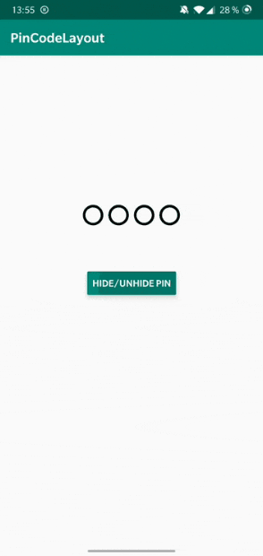
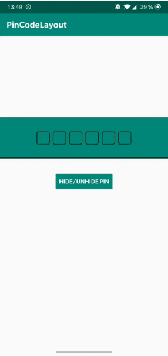

# PinCodeLayout

A customizable AndroidX pincode library for Android API 16+ written in kotlin.
Includes animations as well as active and inactive state indicators.

## Installation

You can include this library by adding the following code to your build.gradle (app) file:

``` Groovy

dependencies {
	implementation "com.github.bitfactoryio:PinCodeLayout:1.0.3"
}

```

Also make sure to include the following line in your project build.gradle file:

``` Groovy

allprojects {
    repositories {
        maven { url "https://jitpack.io" }
    }
}

```

>
## Preview

<p>
</p>

## Usage

Add the PinCodeLayout in your xml file:

``` xml

<io.bitfactory.pincodelayout.PinCodeLayout
	android:layout_width="match_parent"
	android:layout_height="wrap_content"
	app:pinLength="6" />

```

Implement the callback and set it to your pinCodeLayout:

``` kotlin
	private val callback: PinCodeActions = object : PinCodeActions {
		override fun onPinEntered(pin: String) {
			// Called when the pin is fully entered. Returns the pin
		}

		override fun onPinCleared() {
			// Called when the pin is cleared/empty
		}

		override fun onPinFilled() {
			// Called when the pin is entered and the View looses focus
		}
	}
	...
	pinCodeLayout.setCallback(callback)

```

An example project can be found in the **example** folder
## Customization

### Changing Pin Length
You can set your desired pin length in the xml via:
``` xml
	app:pinLength="4"
```
### Changing Pin Icon
``` xml
	app:unfilledPinIcon="@drawable/ic_dot_empty"
	app:filledPinIcon="@drawable/ic_dot_filled"
```
``` kotlin
	pinCodeLayout.setUnfilledPinIcon(R.drawable.ic_dot_empty)
	pinCodeLayout.setFilledPinIcon(R.drawable.ic_dot_filled)
```
If your asset is not shown, make sure that the size does not extend the width or height of your pinCodeLayout.

### Hiding pin
You can choose, wheather you want your users to be able to see their input or not.
If not, the unfilledPinIcon will be visible.

``` xml
	app:hidePin="true"
```
``` kotlin
	pinCodeLayout.setHiddenState(true)
```

### Changing Pin Layout Background
You can choose your own background. This can be a simple color or a drawable file

``` xml
	app:inputBackground="@color/colorPrimary"
```
``` kotlin
	pinCodeLayout.setInputBackground(android.R.color.transparent)
```

### Changing colors of the bottom Bar indicator:
Set up in xml:
``` xml
	app:activeBarColor="@color/white"
	app:inactiveBarColor="@color/black"
```
or programmatically: 

``` kotlin
	pinCodeLayout.setActiveBarColor(android.R.color.transparent)
	pinCodeLayout.setInActiveBarColor(android.R.color.transparent)
```
If you choose, not to show the bottom bar indicator, just set its color to transparent.

### Changing Animation duration
By setting a Long value (milliseconds)

``` xml
	app:animationDuration="1000"
```
``` kotlin
	pinCodeLayout.setAnimationDuration(750L)
```

### Changing Pin Type
You can choose one of the following types:
``` xml
	app:pinType="digits"
	app:pinType="capLettersAndDigits"
```
The keyboard will automatically show and accept only valid characters.

### Changing Pin Text Color
``` xml
	app:pinTextColor="@color/black"
```
``` kotlin
	pinCodeLayout.setPinTextColor(R.color.black)
```
